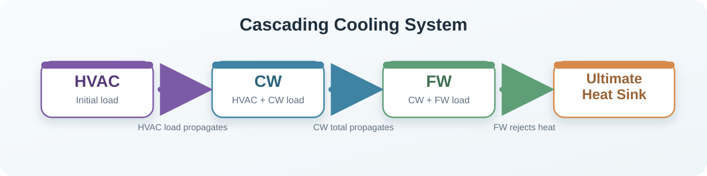
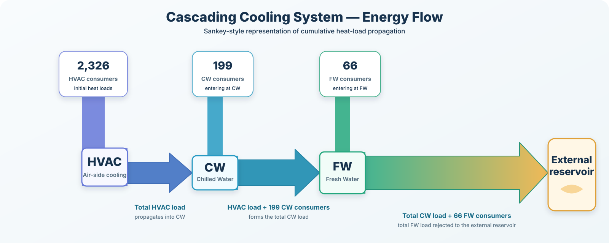

# Monte Carlo Simulation of a Cascading Cooling System

## Project Overview

This project assesses the reliability of a cascading cooling system using Monte Carlo simulation.

The main purpose of the project is to move away from a simple deterministic pass/fail assessment and instead estimate the probability that cooling loads may exceed the available cooling capacity.

Modern cooling systems are often designed and assessed using fixed predicted heat loads. However, predicted loads are uncertain because of modelling assumptions, operational variability, and incomplete knowledge of how the system will behave in practice.

If predicted loads are treated as exact values, the assessment may become over-confident. It may also hide the probability of overload in complex systems that serve many consumers.

This project therefore treats cooling system adequacy as a risk-based problem rather than a simple binary pass/fail check.

## The Cooling System

The cooling system used in this project is made up of three connected subsystems:

- HVAC: Heating, Ventilation and Air Conditioning
- CW: Chilled Water
- FW: Fresh Water

The cooling system is arranged as a cascade:



Throughout the project figures, HVAC is shown in purple, CW in blue, FW in green, and the ultimate heat sink in orange.

This means that the load from one system is passed into the next system downstream.

The system contains the following number of local consumer loads:

| Subsystem | Local consumers |
|---|---:|
| HVAC | 2326 |
| CW | 199 |
| FW | 66 |

## How Loads Propagate Through the System

The load from HVAC is passed into CW.

The total load from CW is then passed into FW.

This means that the downstream systems do not only cool their own local consumers. They also receive the loads from upstream systems.

The following figure shows how local consumer loads enter each subsystem and how the cumulative load is passed downstream:



The total subsystem loads are calculated as:

```text
HVAC total load = sum of HVAC consumer loads

CW total load = HVAC total load + sum of CW consumer loads

FW total load = CW total load + sum of FW consumer loads
```

This cascade structure is important because the FW system receives the accumulated load from both upstream systems.

## Operating Scenarios

Two operating scenarios are assessed:

- Scenario Alpha
- Scenario Bravo

Each scenario represents a different operating state of the system.

In each scenario, a different subset of consumers may be switched on or off. Consumers also have load factors that alter the load placed on the cooling system in that scenario.

A simplified scenario load calculation is:

```text
Scenario load = Base load x Load factor 
```

## Example Scenario Load Calculation

For example, in Scenario Alpha:

```text
ITEM_000114 CW base load = 12.99 kW
Scenario Alpha Lf = 0.98
Scenario Alpha Uf = 1.00

Scenario Alpha load = 12.99 x 0.98 x 1.00
                    = 12.73 kW
```

In Scenario Bravo, the same item is switched off:

```text
ITEM_000114 CW base load = 12.99 kW
Scenario Bravo Lf = 0.00
Scenario Bravo Uf = 0.00

Scenario Bravo load = 12.99 x 0.00 x 0.00
                    = 0.00 kW
```

This means that the same consumer can contribute load in one scenario and no load or a different load in another scenario.

## Why Monte Carlo Simulation Is Used

A deterministic calculation gives one fixed answer.

It answers the question:

Does the system pass or fail for one set of predicted loads?

However, real engineering loads are uncertain.

Monte Carlo simulation allows the project to test many possible load combinations. Instead of assuming every load is fixed, each uncertain load is sampled many times from a probability distribution.

This allows the project to estimate:

- the probability that a subsystem exceeds its available cooling capacity;
- how close each subsystem gets to its capacity;
- which consumers have the strongest influence on the final system risk;
- how different uncertainty assumptions affect the result;
- how dependency between loads affects downstream risk.

## Project Motivation

Modern cooling systems are often assessed using deterministic heat load estimates.

This can be useful, but it does not show how likely overload is when the input loads are uncertain.

This is especially important in complex systems that serve many consumers. Small uncertainties across many consumers can combine and propagate through the cascade.

The project is focused on a no-measured-data scenario. This reflects realistic engineering situations where measured operational data may not be available, for example during early-stage design or where testing is too costly.

## Project Objectives

The project aims to answer the following questions:

1. Can a Monte Carlo simulation framework be designed to propagate uncertainty through a cascaded cooling system?
2. What is the probability that each subsystem exceeds its available cooling capacity?
3. Which consumers have the strongest influence on the cooling system risk?
4. How do different uncertainty assumptions affect the results?
5. How does dependency between loads affect downstream risk amplification?

## Uncertainty Modelling

Two uncertainty models are compared:

- Triangular distribution
- Truncated normal distribution

These distributions are used to represent uncertainty in the predicted consumer loads.

The triangular distribution is simple and bounded.

The truncated normal distribution is also bounded, but allows values to vary around the expected load in a more statistically familiar way.

Using two distributions allows the project to test whether the conclusions are sensitive to the choice of uncertainty model.

## Dependency Modelling

The project also compares independent and dependent load assumptions.

In the independent model, each consumer load varies separately.

In the dependent model, loads can rise or fall together.

This matters because cooling loads may be affected by common operating conditions. For example, if one load is high, other related loads may also be high.

Positive dependency can increase risk because several high-load consumers may occur at the same time.

## Notebook Workflow

The project is organised as a set of Jupyter notebooks.

Each notebook performs one stage of the analysis.

## Notebook 01: Key Terms and Acronyms

This notebook defines the main engineering, uncertainty, Monte Carlo, dependency modelling, sensitivity, and verification terms used throughout the project.

It is intended as a quick reference before reading the analysis notebooks.

## Notebook 02: Data Ingestion and EDA

This notebook loads the raw data workbook and checks the structure of the dataset.

It reshapes the data into a modelling format and counts the number of load records assigned to HVAC, CW and FW.

It also identifies rows that represent propagated loads between systems. This is important because propagated loads must not be counted twice.

## Notebook 03: Deterministic Baseline

This notebook calculates the deterministic baseline load for each subsystem.

It applies the cascade calculation:

HVAC -> CW -> FW

The deterministic baseline is used as the starting point for the project.

It shows whether the system passes or fails when all loads are treated as fixed values.

## Notebook 04: Uncertainty Modelling

This notebook defines the uncertainty distributions used in the Monte Carlo simulation.

It creates the triangular and truncated normal sampling parameters for each consumer load.

It also checks that sampled values remain within the expected physical bounds.

## Notebook 05: Independent Monte Carlo Simulation

This notebook runs the Monte Carlo simulation assuming that all consumer loads are independent.

It calculates:

- mean sampled load;
- P95 load;
- P99 load;
- spare capacity;
- load-to-capacity ratio;
- overload probability.

This gives the first probabilistic view of the system.

## Notebook 06: Dependency Modelling

This notebook introduces dependency between loads.

A Gaussian copula is used to model correlated demand.

This tests whether the system risk changes when high loads are more likely to occur together.

This is important because dependency can increase downstream risk in a cascaded system.

## Notebook 07: Sensitivity Analysis

This notebook identifies which consumers and assumptions have the strongest influence on the result.

It uses:

- Spearman correlation;
- logistic regression where overload events exist;
- Design of Experiments style screening.

The purpose is to understand what is driving the risk, rather than only reporting the final overload probability.

## Notebook 08: Verification and Convergence

This notebook checks that the model behaves correctly.

It verifies:

- conservation of load propagation through the cascade;
- enforcement of physical bounds on sampled values;
- consistency of overload probability with increasing uncertainty;
- Monte Carlo convergence with increasing sample size.

The convergence check confirms that the simulation result is stable enough for interpretation.

## Notebook 09: Results and Discussion

This notebook brings together the results from the previous notebooks.

It explains the main findings and discusses what they mean for the cooling system.

The key conclusion is that deterministic and independent uncertainty assumptions do not show overload, but positive dependency between loads can create a material overload risk in the downstream FW system.

## Overall Conclusion

The project shows that deterministic analysis alone can understate the risk in a cascaded cooling system.

When loads are treated as fixed values, the system appears to pass.

When uncertainty is included independently, the system still remains below capacity in the assessed cases.

However, when positive dependency is introduced, high-load conditions can occur together. This increases the downstream FW load and can lead to capacity exceedance under the most conservative case.

The project therefore shows why Monte Carlo simulation and dependency modelling can provide a more informative assessment of cooling system reliability than a simple deterministic pass/fail calculation.
